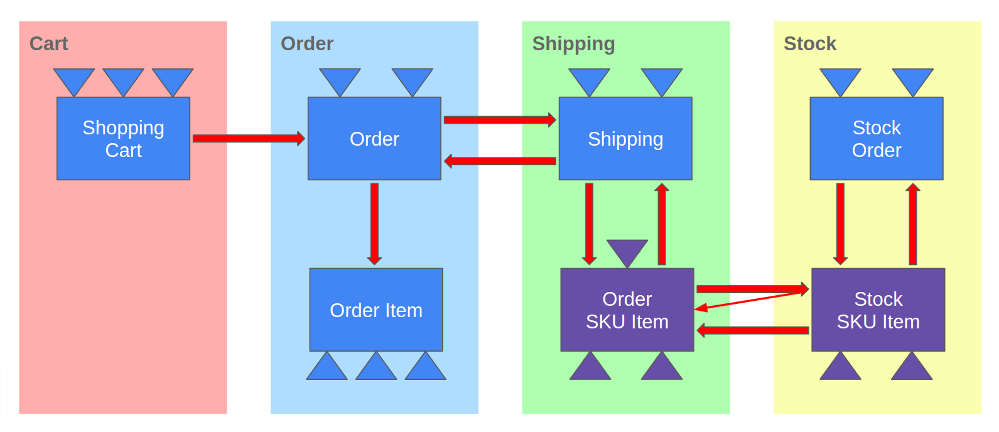
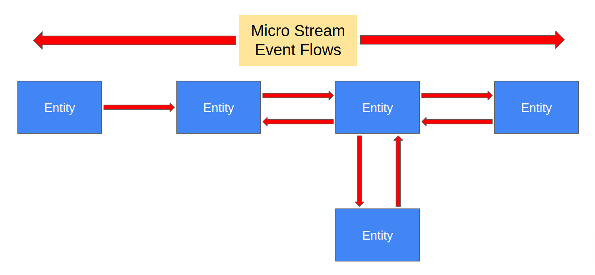
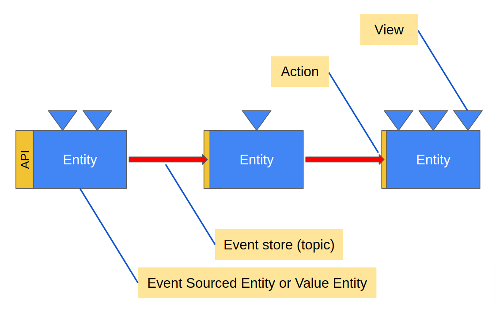

# Order Processing Java Demo

This project is a demo of an order processing app. The demo comprises services that handle a basic order processing flow. For example, the Shopping Cart service creates orders when carts are checked out, and the Stock Order service makes stock items.

The order processing services shown in the following diagram communicate via asynchronous messages. For example, a shopping cart check-out event triggers an asynchronous notification to the Order service. Each arrow in the diagram represents asynchronous event flows.

An order processing sequence typically involves first creating some stock SKU items via the Stock service API. Then make and check-out orders via the Shopping Cart service API. At check-out, the other services are used to allocate stock SKU items to order SKU items.

| 
|:--:
| Figure 1 - Order Processing Design

The above design shows multiple service component entities that interact with each other via asynchronous event flows. The boxes represent entities encapsulating service APIs, processing logic, and emitting state change events. A more generic event flow diagram shown below (Figure 2) depicts a micro stream. Micro streams are these event-driven flows where services interact via asynchronous event streams. The arrows in these micro stream diagrams represent the events emitted by upstream services flowing to downstream services. Note that micro stream flows are often bidirectional. With Bidirectional flows, service A emits events consumed by service B, and service B emits events consumed by service A.

| 
|:--:
| Figure 2 - Micro Stream Event Flows |

The following diagram (Figure 3) shows more of the implementation details of micro streams. Each service entity includes a defined API and specific event types, and entities receive requests as commands via the API. Commands are requests to perform entity state-changing actions, such as a command to add an item to a shopping cart, and events represent specific entity state changes. So, commands are requests to perform actions while events are historical facts about things that have happened in the past.

Each arrow represents an event store or event journal, and these event stores are also event/message delivery topics. Arrowheads represent actions that consume incoming events and then transform them into commands forwarded to downstream entities.

The triangles in the diagram represent queryable views. Views also consume entity events transforming them into view data.

| 
|:--:
| Figure 3 - Micro Stream Overview

---

## The following sections were generated when this project was created

See [Development Tools/Maven archtype](https://developer.lightbend.com/docs/akka-serverless/java/developer-tools.html#_maven_archetype)

## Designing

While designing your service it is useful to read [designing services](https://developer.lightbend.com/docs/akka-serverless/services/development-process.html)

## Developing

This project has a bare-bones skeleton service ready to go, but in order to adapt and
extend it it may be useful to read up on [developing services](https://developer.lightbend.com/docs/akka-serverless/developing/index.html)
and in particular the [Java section](https://developer.lightbend.com/docs/akka-serverless/java-services/index.html)

## Building

You can use Maven to build your project, which will also take care of
generating code based on the `.proto` definitions:

```shell
mvn compile
```

## Running Locally

In order to run your application locally, you must run the Akka Serverless proxy. The included `docker-compose` file contains the configuration required to run the proxy for a locally running application.
It also contains the configuration to start a local Google Pub/Sub emulator that the Akka Serverless proxy will connect to.
To start the proxy, run the following command from this directory:

```shell
docker-compose up
```

To start the application locally, the `exec-maven-plugin` is used. Use the following command:

```shell
mvn compile exec:exec
```

With both the proxy and your application running, any defined endpoints should be available at `http://localhost:9000`. In addition to the defined gRPC interface, each method has a corresponding HTTP endpoint. Unless configured otherwise (see [Transcoding HTTP](https://developer.lightbend.com/docs/akka-serverless/java/proto.html#_transcoding_http)), this endpoint accepts POST requests at the path `/[package].[entity name]/[method]`. For example, using `curl`:

```shell
> curl -XPOST -H "Content-Type: application/json" localhost:9000/io.shopping.cart.CounterService/GetCurrentCounter -d '{"counterId": "foo"}'
The command handler for `GetCurrentCounter` is not implemented, yet
```

For example, using [`grpcurl`](https://github.com/fullstorydev/grpcurl):

```shell
> grpcurl -plaintext -d '{"counterId": "foo"}' localhost:9000 io.shopping.cart.CounterService/GetCurrentCounter 
ERROR:
  Code: Unknown
  Message: The command handler for `GetCurrentCounter` is not implemented, yet
```

> Note: The failure is to be expected if you have not yet provided an implementation of `GetCurrentCounter` in
> your entity.

## Deploying

To deploy your service, install the `akkasls` CLI as documented in
[Setting up a local development environment](https://developer.lightbend.com/docs/akka-serverless/setting-up/)
and configure a Docker Registry to upload your docker image to.

You will need to update the `dockerImage` property in the `pom.xml` and refer to
[Configuring registries](https://developer.lightbend.com/docs/akka-serverless/projects/container-registries.html)
for more information on how to make your docker image available to Akka Serverless.

Finally, you can use the [Akka Serverless Console](https://console.akkaserverless.com)
to create a project and then deploy your service into the project either by using `mvn deploy` which
will also conveniently package and publish your docker image prior to deployment, or by first packaging and
publishing the docker image through `mvn clean package docker:push -DskipTests` and then deploying the image
through the `akkasls` CLI or via the web interface.
